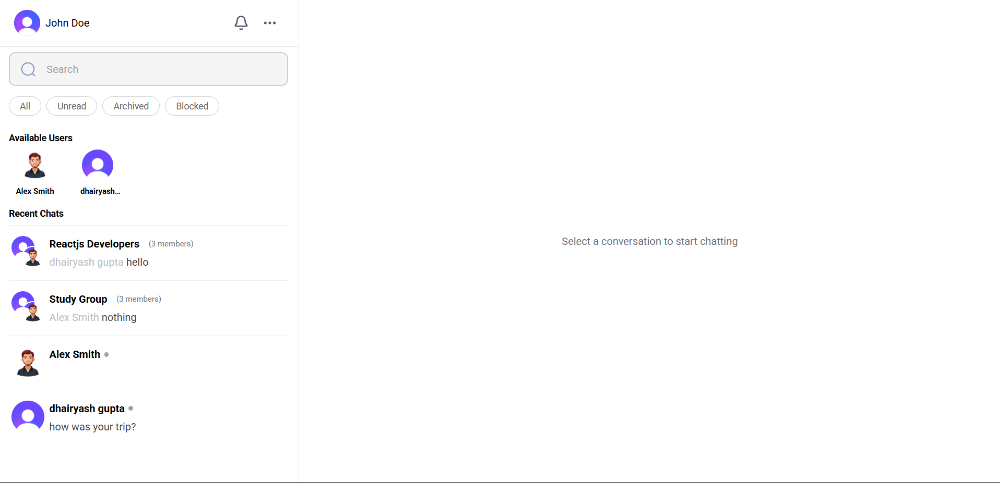
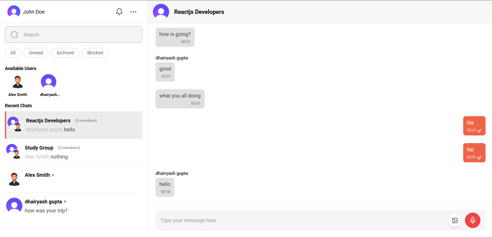
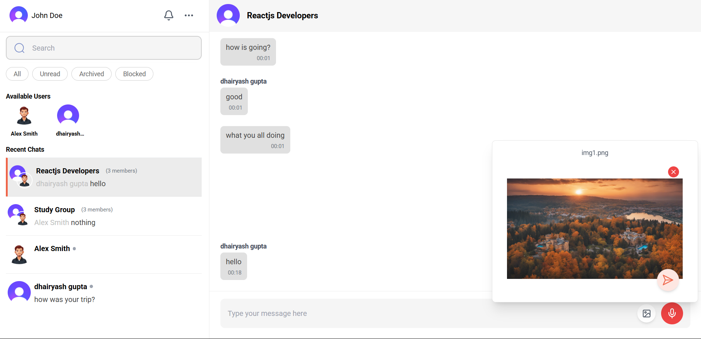

# 💬 Chat-Flow

A scalable real-time chat application built using modern technologies like **ReactJS**, **Socket.IO**, **Redis**, **Kafka**, and **PostgreSQL** — designed to handle one-to-one and group chats with file sharing, real-time notifications, and horizontal scalability.

---

## 🛠 Tech Stack

### Frontend

- **ReactJS** with **TypeScript**
- **Redux Toolkit Query** for efficient data fetching
- **Axios** for REST API communication
- **Clerk** for authentication and user management
- **Socket.IO-client** for real-time messaging
- **Responsive UI** (custom-styled or CSS framework)

### Backend

- **Node.js + Express**
- **TypeScript**
- **Socket.IO** for WebSocket communication
- **PostgreSQL** with optimized schema
- **Kafka** for message queuing & high-throughput writes
- **Redis Pub/Sub** for real-time message delivery across multiple servers
- **Clerk JWT Verification** middleware for protected routes and socket events

## 🔥 Features

✅ One-to-one chat  
✅ Group chat with multiple users  
✅ Send & receive media: **images, videos, documents**  
✅ Real-time messaging using **Socket.IO**  
✅ Notifications for new messages  
✅ Message persistence via Kafka queue  
✅ Redis Pub/Sub for multi-node scalability  
✅ PostgreSQL for relational data storage  
✅ Clean and responsive UI

---

## 📸 Screenshots

### 🔐 Main Screen



### 👥 Group Chat



### 🖼 Media Sharing



> ℹ️ You can also include a demo video/gif here.

---

## 🧪 How to Run Locally

> Prerequisite: Redis, Kafka, PostgreSQL must be installed and running.

1. **Add environment variables**  
   Copy `.env.sample` to `.env` in both `client` and `server` folders and fill in all required values before running.

### Backend

```bash
cd server
npm install
npm run dev
```

### Frontend

```bash
cd client
npm install
npm run dev
```

---

## 🧗 Challenges I Solved

- ✅ WebSocket scaling using **Redis Pub/Sub**
- ✅ Ensuring delivery of media messages and persistent storage
- ✅ Offloading DB writes using **Kafka** to prevent latency and bottlenecks
- ✅ Supporting multiple client connections with proper room handling and group synchronization

---

## 🧍‍♂️ Author

Built with ❤️ by **Dhairyash** — Full Stack Developer skilled in designing and scaling modern web applications.

---
